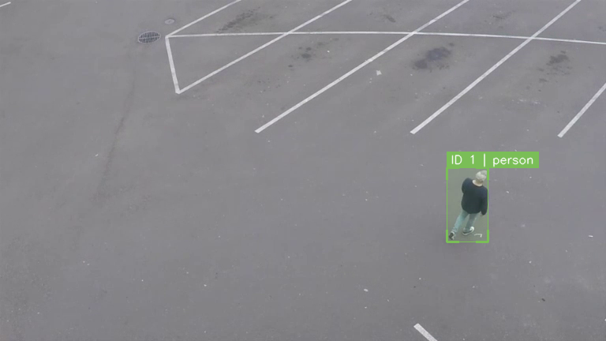

# Object Detection and Tracking with YOLO & SORT



This project performs real-time object detection and tracking on webcams or video files. It leverages a pre-trained **YOLOv8** model for high-speed object detection and a custom, dependency-free implementation of the **SORT (Simple Online and Realtime Tracking)** algorithm utilizing Kalman Filters and Hungarian association.

## Features

- **Real-time Video Processing**: Capture input via webcam or read from video files.
- **YOLOv8 Detection**: High-performance object detection using Ultralytics YOLOv8.
- **SORT Tracker**: Frame-by-frame object tracking using a NumPy-based Kalman Filter and SciPy linear sum assignment.
- **Premium Visualization**: Elegant corners on bounding boxes, unique colors dynamically generated per Track ID, and a semi-transparent HUD showing system FPS.

---

## Setup Instructions

### 1. Pre-requisites

Ensure you have Python 3.8+ installed on your system.

### 2. Install Dependencies

Open a terminal or command prompt in this directory (`ObjectTracking`) and run:

```bash
pip install -r requirements.txt
```

This will install:
- `numpy`
- `scipy`
- `opencv-python` (for frame capturing and rendering)
- `ultralytics` (for YOLOv8)

---

## Usage Guide

You can run the tracking app using `tracker_app.py`. By default, it will attempt to use your default webcam (index `0`) and run the lightweight `yolov8n.pt` (nano) model.

### 1. Default Webcam Tracking
```bash
python tracker_app.py
```

### 2. Video File Tracking (Demo Video)
For testing, you can download this standard [Intel Sample Video](https://raw.githubusercontent.com/intel-iot-devkit/sample-videos/master/person-bicycle-car-detection.mp4) (contains people, cars, and bicycles).

Run the tracker on the downloaded video:
```bash
python tracker_app.py --source "path/to/your/video.mp4"
```

*Note: If you run `python tracker_app.py` and don't have a webcam connected, the application will automatically download and use this sample video as a fallback.*

### 3. Track Specific Classes
You can filter detections to only track specific classes (e.g., class `0` is for `person` in the COCO dataset):
```bash
python tracker_app.py --classes 0
```
To track multiple classes (e.g., people `0` and cars `2`):
```bash
python tracker_app.py --classes 0 2
```

### 4. Custom Model & Higher Confidence
Run a larger model (e.g., `yolov8s.pt` for small) and raise the confidence threshold to `0.5` to eliminate false positives:
```bash
python tracker_app.py --model yolov8s.pt --conf 0.5
```

---

## Controls
- Press **`q`** while focusing on the output video window to close the stream and exit the application.
